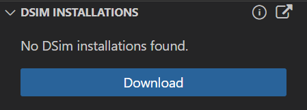

# Tooling

This project is beeing developed on Windows 10 OS using free version of Altair DSim (simulator) and DSim Studio (VSCode extension). Other OSs and simulators are supported, but not yet verified.

For code highlighting and linting, TerosHDL VSCode extension is used with Vivado, Verilator and Verible.

## Simulator Setup

The provided verification environment is based on the **Universal Verification Methodology (UVM)**. To run the tests, you must use a simulator that supports SystemVerilog and UVM.

### Altair DSim

The DSim from Altair includes a UVM-compliant simulator (dsim) that is fully capable of running the testbenches in this project. A free version is available. There is also provided an extension for VSCode - DSim Studio, that makes running simulations easier right from the IDE.

This section was written for Altair DSim v2025.1.

<https://learn.altair.com/learn/course/getting-started-with-dsim-elearning/table-of-contents/getting-started-with-dsim?page=1>

* **Installation**
  * Register for user account on [www.altairone.com](https://admin.altairone.com/register)
  * Download and install VSCode DSim Studio extension:  
    <https://marketplace.visualstudio.com/items?itemName=AltairEngineering.dsim-studio>
  * In the VSCode primary sidebar select "DSim Studio" extension tab  
  
  * There is an interactive "Installing DSim Walkthrough" that can be opened by clicking `( i )` icon in "DSim Installations" section, which will open in a "Welcome" window.  
  
  * Click "Sign in to DSim Cloud..." in "DSim Studio" section.
  * Click "Download" button in "DSim Installations" section.  
  
  * Download and install DSim (simulator).
  * Activate installed DSim version in the DSim Studio "DSim Installations" section - right-click on the DSim version to activate it.
  * Activate and download free license on Altair DSim Cloud - click "Manage Free Individual License" icon in "Versions" sub-section of "DSim Installations" section:  
    <https://app.metricsvcloud.com/security/licenses>  
    Make sure to click "Install license using DSim Studio" icon next to the license on the website and follow through to complete the action using VSCode.
    DSim Studio will show check mark "License Activated" next to "Manage Free Individual License" icon in "Versions" sub-section of "DSim Installations" section.
  * Open "DSim Studio" terminal.
  * DSim Studio projects are configured by `*.dpf` files.

#### DSim DPI-C

Most verification models are implemented with C reference functions. C functions are called from UVM testbench model using DPI-C.

* <https://help.metrics.ca/support/solutions/articles/154000141123-how-to-integrate-c-c-files-with-your-design>
* <https://help.metrics.ca/support/solutions/articles/154000141203-user-guide-dsim-using-the-dpi-and-pli>

### Xilinx Vivado (Recommended for UVM)

The Vivado Design Suite from AMD/Xilinx includes a UVM-compliant simulator (xsim) that is fully capable of running the testbenches in this project. A free version (Vivado ML Edition) is available.

* **Installation**:  
  1. Go to the official AMD/Xilinx downloads page: [https://www.xilinx.com/support/download.html](https://www.xilinx.com/support/download.html)  
  2. Download the **Vivado ML Edition** installer for your operating system.  
  3. During installation, you can deselect the device families to save space, but ensure the **Verification \-\> Vivado Simulator** component is selected.  
* **Environment Setup**: Before running make, you must source the setup script to add the Vivado tools to your path.  
  * On Linux: source /path/to/Xilinx/Vivado/2023.2/settings64.sh  
  * On Windows: Run the Vivado command prompt, or execute the settings64.bat script.

### Synopsys VCS

VCS is a high-performance commercial simulator.

* **Installation**: VCS is a licensed product from Synopsys. It is typically installed in a corporate or academic environment. Please follow the installation and environment setup guides provided by your organization or university.
* **Usage**: The included vcs.mk is configured for VCS. You can run make commands using vcs.mk to compile and run the tests using VCS.

### Icarus Verilog (for non-UVM designs)

Icarus Verilog is an excellent open-source Verilog simulator. However, it **does not support UVM**. It is suitable for running basic, non-UVM SystemVerilog testbenches but will fail to compile the verification environment in this repository.

* **Installation (Linux \- Debian/Ubuntu)**:  
  sudo apt-get update  
  sudo apt-get install iverilog  

* **Installation (Linux \- RedHat/CentOS)**:  
  sudo yum install iverilog

* **Installation (macOS via Homebrew)**:  
  brew install icarus-verilog

* Installation (Windows):  
  Pre-compiled binaries are available for download from the official Icarus website: <http://iverilog.icarus.com/>

### Verible (for Style Linting and Formatting)

[Verible](https://github.com/google/verible) is a suite of open-source SystemVerilog developer tools, including a style linter and code formatter. In this project, it is used as a style linter to enforce coding conventions.

* **Installation (Linux - via pre-compiled binary)**:  
  Download the latest static binary for Ubuntu from the [releases page](https://github.com/google/verible/releases) and place it in your `PATH`.

* **Installation (macOS via Homebrew)**:  

```bash
brew install verible
```

* **Installation (Windows)**:  

Download release zip file (you may want to check the latest version):

```bash
curl -L -o verible-win.zip https://github.com/chipsalliance/verible/releases/download/v0.0-4023-gc1271a00/verible-v0.0-4023-gc1271a00-win64.zip
```

Then unzip `verible-win.zip` file, and copy contents of the unzipped folder `verible-v0.0-4023-gc1271a00-win64` (a group of .exe files) to `C:/Program Files/verible`.

Add `C:/Program Files/verible` to your system's PATH environment variable, then restart VSCode.

The style rules are configured in the `.rules.verible_lint` file in the project root.

### Verilator (for Linting)

Note: [vscode-terosHDL#815](https://github.com/TerosTechnology/vscode-terosHDL/issues/815) - Verilator linter does not work under TerosHDL. Use Vivado instead.

[Verilator](https://verilator.org) is a high-performance, open-source Verilog/SystemVerilog simulator and linter. In this project, it is primarily used as a linter to perform static code analysis, as configured in the TerosHDL settings.

* **Installation (Linux - Debian/Ubuntu)**:  

```bash
sudo apt-get update
sudo apt-get install verilator
```

* **Installation (Linux - RedHat/CentOS)**:  

```bash
sudo yum install verilator
```

* **Installation (macOS via Homebrew)**:  

```bash
brew install verilator
```

* **Installation (Windows)**:  
  Verilator can be installed on Windows by:
  * **Using WSL**: Install your preferred Linux distribution from the Microsoft Store and then follow the Linux installation instructions above within the WSL environment.
  * **Using MSYS2 package**: After installing MSYS2, run `pacman -S mingw-w64-x86_64-verilator` in the MSYS2 terminal. Note: As of 2025-0925 it gets pretty old version, and has trouble loading its own shared libs.
  * **Building from Source under MSYS2**: It gets the latest version, and can be patched to fix some issues. After installing MSYS2, run in MSYS2 or git bash terminal:

```bash
# Install some prerequisites:
pacman -S help2man

# Clone repo:
cd ~
git clone https://github.com/verilator/verilator.git
cd verilator
git checkout origin/stable # or any release tag

# Configure:
unset VERILATOR_ROOT
# export VERILATOR_ROOT=/usr
autoconf
./configure  --prefix=/usr

# Patch:
cp /usr/include/FlexLexer.h ./src  # Fix missing header file
# Any other patches

# Build:
make -j$(nproc)

# Install:
make install

# Check:
verilator --version

```

Under Windows MSYS2, for allowing VSCode extensions to find verilator, it is recommended to add `C:\msys64\usr\bin` to PATH environment variable.

#### Additional Patches

As of 2025-0927, origin/stable branch of verilator source builds `Verilator 5.040 2025-08-30 rev v5.040-50-g0a9d9db5a`. It has trouble finding its own .vlt and .sv files due to using $VERILATOR_ROOT/include/, instead of $VERILATOR_ROOT/share/verilator/include/ (where it actually installs these files). The issue can be patched in src/V3Options.cpp prior to `make`:

```c
  string V3Options::getStdPackagePath() {
-     return V3Os::filenameJoin(getenvVERILATOR_ROOT(), "include", "verilated_std.sv");
+     return V3Os::filenameJoin(getenvVERILATOR_ROOT(), "share", "verilator", "include", "verilated_std.sv");
  }
  string V3Options::getStdWaiverPath() {
-     return V3Os::filenameJoin(getenvVERILATOR_ROOT(), "include", "verilated_std_waiver.vlt");
+     return V3Os::filenameJoin(getenvVERILATOR_ROOT(), "share", "verilator", "include", "verilated_std_waiver.vlt");
  }
```

## VSCode Integration

### DSim Studio

See [Altair DSim](#altair-dsim) section.

### TerosHDL

1. Python3 should be installed.
2. Install required python packages `pip install -r requirements.txt`.
3. `make` should be installed. It is part of git bash on Windows and comes standard on Linux and macOS.
4. Install [Xilinx Vivado](#xilinx-vivado-recommended-for-uvm).  
   Make sure `vivado` is added to the PATH, run `which vivado` in bash or `where vivado.bat` in Windows CMD to check.  
   If vivado is not found, add Vivado installation to PATH environment variable.
5. Install [TerosHDL extension](https://marketplace.visualstudio.com/items?itemName=teros-technology.teroshdl)
6. Configure TerosHDL
   1. Open VSCode and select the TerosHDL icon on the sidebar.
   2. Go to "Configuration" section and choose "Open Global Settings Menu".
   3. You can load settings from either "teros-hdl.settings+verilator+verible.json" file or "teros-hdl.settings.json" file. Alternatively:
   4. Under "Linter settings", select "Vivado" to enable Vivado as code linter.
   5. Under "Linter settings" > "Vivado linter", enter "-i <include_path>" for each include path into "Verilog/SV linter arguments".  
   Note: [vscode-terosHDL#816](https://github.com/TerosTechnology/vscode-terosHDL/issues/816) Include paths don't work as expected. Use absolute paths in Vivado arguments until the issue is resolved.
   6. Under "Tools," set the default synthesis/simulation tool to Vivado.
7. Use the "Verify Setup" command in the TerosHDL sidebar to check configuration and tool detection. Review Output > TerosHDL: Global log and correct any missing tools.  
Note: "Verify Setup" can be tricky to troubleshoot - make sure project setup does not inadvertently override global Vivado path setting (see [vscode-terosHDL#778](https://github.com/TerosTechnology/vscode-terosHDL/issues/778)).

## UVM

### Parameterized Tests

Parameterization can remove a lot of redundant code.

In UVM it is not trivial to run a parameterized test due to UVM registry quirks.

#### Method 1

Create pseudo-classes in test package file *_pkg.sv, and then call simulator with `+UVM_TESTNAME=<pseudo-class>` on command line:

```verilog
  package ...

    ...

    // Macro to create wrapper classes for different precisions
    `define CREATE_FP_TEST_WRAPPER(width_val, base_class, wrapper_name) \
        class wrapper_name extends base_class#(.WIDTH(width_val)); \
            `uvm_component_utils(wrapper_name) \
            function new(string name=`"wrapper_name`", uvm_component parent=null); \
                super.new(name, parent); \
            endfunction \
        endclass

    `CREATE_FP_TEST_WRAPPER(16, fp_add_random_test,        fp16_add_random_test        )
    `CREATE_FP_TEST_WRAPPER(16, fp_add_special_cases_test, fp16_add_special_cases_test )
    `CREATE_FP_TEST_WRAPPER(16, fp_add_combined_test,      fp16_add_combined_test      )
    `CREATE_FP_TEST_WRAPPER(32, fp_add_random_test,        fp32_add_random_test        )
    `CREATE_FP_TEST_WRAPPER(32, fp_add_special_cases_test, fp32_add_special_cases_test )
    `CREATE_FP_TEST_WRAPPER(32, fp_add_combined_test,      fp32_add_combined_test      )
    `CREATE_FP_TEST_WRAPPER(64, fp_add_random_test,        fp64_add_random_test        )
    `CREATE_FP_TEST_WRAPPER(64, fp_add_special_cases_test, fp64_add_special_cases_test )
    `CREATE_FP_TEST_WRAPPER(64, fp_add_combined_test,      fp64_add_combined_test      )
    ... etc.

    // Cleanup the macro
    `undef CREATE_FP_TEST_WRAPPER
```

Method 1 is clunky and super verbose - each test has to be wrapped with one new class for each possible parameter value, for multiple parameters - for each permutation of all parameters. It is all concentrated in the package file and makes a huge boilerplate codebase.

#### Method 2 (Used here)

This method is based on <https://dvcon-proceedings.org/wp-content/uploads/parameters-uvm-coverage-emulation-take-two-and-call-me-in-the-morning.pdf>

It is much more compact than Method 1 and better scalable. Each test module is responsible for its own registration with 1 line. The only overhead is needing to list each test module in the corresponding test top module, but it is required to do only once per test module.

Usage:

1. In the test module use:
  
   ```verilog
   `my_uvm_component_param_utils(<component> #(<params>), "<component_name>")
   ```
  
   in place of

   ```verilog
   `uvm_component_param_utils(<component> #(<params>))
   ```
  
2. Add typedef (one for each test module) to the testbench top (it declares type so that the UVM registration happens):
  
    ```verilog
    typedef <component> #(<params>) <component>_t;
    ```

3. Use `+UVM_TESTNAME=<component_name>` in command line to select the test.
