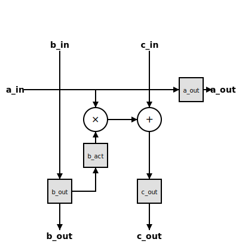

# Implementation Details

## Processing Element (PE)

The Processing Element is the core computation unit of the systolic array. It performs a Multiply-Accumulate (MAC) operation and handles data routing.

### Features

* **Double Buffered Weights**: To maximize throughput, weights (`b`) are double-buffered.
  * **Load Register (`b_out`)**: Loaded serially from the top (`b_in`) when `b_load` is active. This allows the next set of weights to be preloaded while the current computation is running. It also forwards the weight to the PE below.
  * **Active Register (`b_active`)**: Updates from the load register (`b_out`) when `b_update` is active. This value is used for the MAC operation.
* **Registered Outputs**: All outputs (`a_out`, `b_out`, `c_out`) are registered to ensure timing closure and correct systolic operation.
* **Daisy Chaining**:
  * Activation (`a`) is passed from left to right.
  * Partial Sum (`c`) is passed from top to bottom.
  * Weights (`b`) are passed from top to bottom during the load phase.

### Block Diagram

The following diagram illustrates the internal architecture of a single PE cell.

* **Squares**: Represent registers (Flip-Flops).
* **Circles**: Represent combinatorial arithmetic operations (Multiplier and Adder).

Control signals (b_load and b_update) are not shown.

## Implementation Notes

### Parameterization

Though best practice is to have fully-parameterized modules (e.g. WIDTH) instead of hard-coded values, for this exercise parameterization was not implemented.

### Pipeline Depth

Pipeline depth for PE is 1, and all the surrounding modules are hardcoded for 2x2 array and 1-deep pipeline in both directions, as it is not truly targeting implementation in silicon.

For any practical use, larger int's or even floating point format should be considered, and for high-speed implementations a fused MUL-ADD cell with appropriate pipeline depth should be used.

### Verification Testbench

A very simple testbench is provided with requested test cases just to demonstrate that design works. A proper UVM testbench is advised for any practical use.

### Performance Analysis & Optimization Feasibility

The current implementation utilizes a global `b_update` signal for double-buffered weights. Due to the systolic nature of the array (diagonal wavefront of activation data), this results in idle cycles for PEs.

Here we analyze three implementation options and their impact on ALU utilization.

**Definitions:**

* $R$: `ROWS`
* $C$: `COLS`
* $L$: `ALU_LATENCY`
* $T_{compute}$: Active cycles per PE per matrix multiplication ($= R$).
* $T_{period}$: Cycles between the start of consecutive matrix multiplications.
* Utilization $\eta = \frac{T_{compute}}{T_{period}}$.

#### Option 1: Single Buffered B Matrix

In this scenario, computation must fully complete before new weights can be loaded.

* **Mechanism**: Load B $\rightarrow$ Compute $\rightarrow$ Load B ...
* **Timing**:
  * Load Time: $R$ cycles (assuming parallel column load, serial row shift).
  * Compute Time: Determined by the last PE (bottom-right) finishing its operation.
    $T_{finish} = R + (R-1)L + (C-1)$.
* **Period**: $2R + (R-1)L + C - 1$.
* **Utilization**:
  $$ \eta = \frac{R}{2R + (R-1)L + C - 1} $$
  * For a square array $R=C$ and $L=1$: $\eta \approx \frac{R}{4R} \approx 25\%$.

#### Option 2: Double Buffered with Global Update (Current Implementation)

Weights are loaded in the background. However, the update is synchronized globally. We must wait for the "slowest" PE (bottom-right) to finish the current batch before switching weights for the entire array.

* **Mechanism**: Load B (background) $\rightarrow$ Wait for all PEs $\rightarrow$ Global Update $\rightarrow$ Compute.
* **Timing**:
  * The last PE finishes at cycle $R + (R-1)L + (C-1)$.
* **Period**: $R + (R-1)L + C - 1$.
* **Utilization**:
  $$ \eta = \frac{R}{R + (R-1)L + C - 1} $$
  * For a square array $R=C$ and $L=1$: $\eta \approx \frac{R}{3R} \approx 33\%$.

#### Option 3: Double Buffered with Staggered Update

The `b_update` signal is propagated as a wavefront, matching the propagation delay of the activation matrix $A$ (both vertical skew due to latency and horizontal propagation).

* **Mechanism**: `b_update` is pipelined. PE(i,j) updates weights exactly when it finishes its stream of A inputs.
* **Timing**:
  * The pipeline is kept fully filled. Row 0 starts Batch $k+1$ immediately after Batch $k$.
* **Period**: $R$ (limited only by the length of the input sequence).
* **Utilization**:
  $$ \eta = \frac{R}{R} = 100\% $$

**Impact of Latency ($L > 1$)**: With deeply pipelined ALUs, the `b_update` signal must be skewed vertically by $L$ cycles per row to match the propagation of the data wavefront. This added complexity in the control logic ensures that the weight switchover occurs seamlessly at each PE exactly when the new batch arrives. Consequently, while $L$ increases the total time to result (latency) and the depth of the update skew, it does not affect the issue rate (throughput), preserving 100% utilization.

#### Conclusion

Implementing individual `b_update` signals to each PE element aligned to the pipelines would allow 100% ALU utilization, but it is considered outside of the scope for this exercise.
