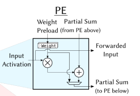
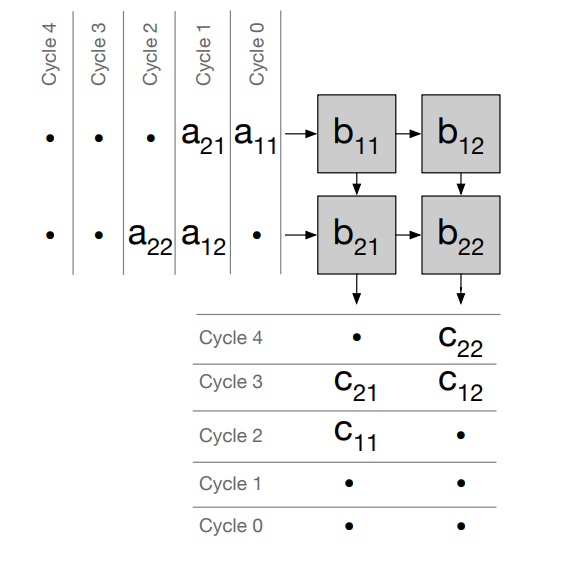
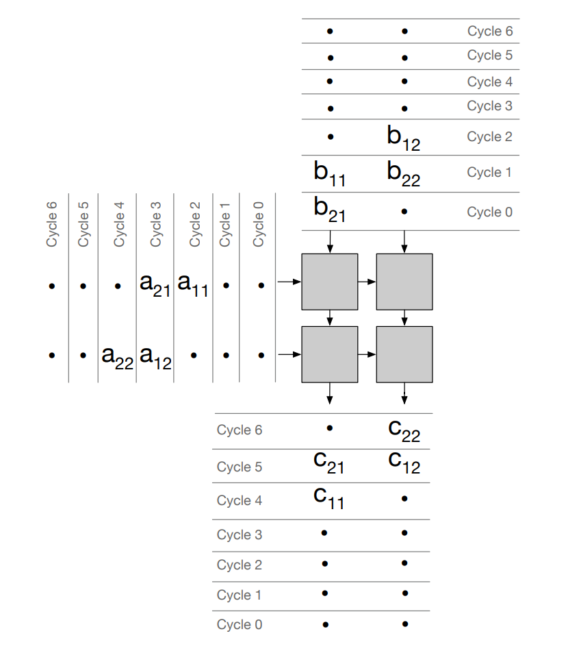
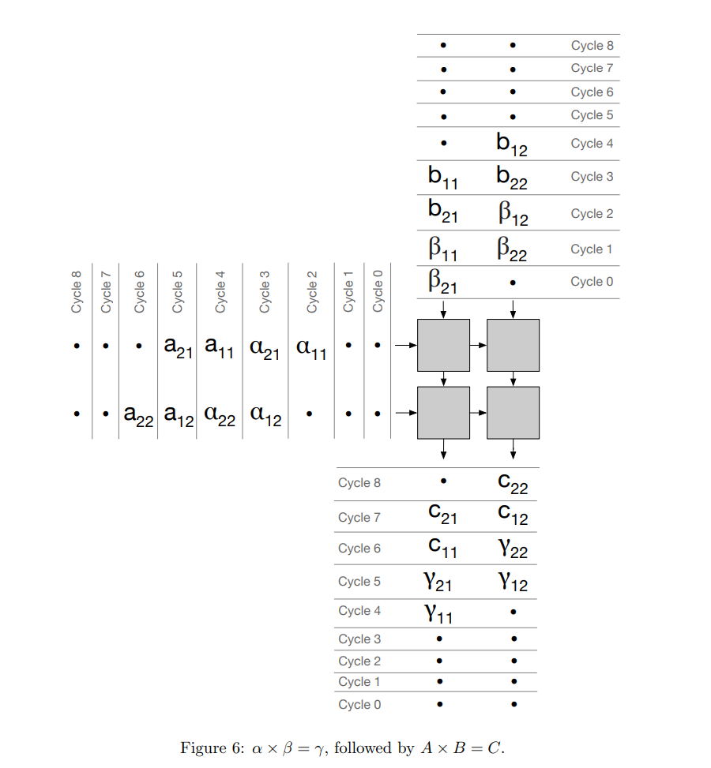

# Systolic Array

## Background

### Matrix Multiplication

Matrix multiplication is a major part of the computation for many applications. Here we consider a NxN matrix multiplication:

$C = A \cdot B + D$

For simplicity, for this discussion we will ignore D and consider only $C = A \cdot B$. E.g.:

```C
for (int i= 0; i< N; i++) {
  for (int j = 0; j < N; j++) {
    C[i,j] = 0;
    for (int k = 0; k < N; k++) {
      C[i,j] += A[i,k] * B[k,j];
    }
  }
}
```

### Processing Elements



A Processing Element (PE) is a basic ALU unit that we will use in this systolic array implementations.

A basic PE has 3 data inputs, 3 data outputs.

Data Inputs:

- Input Activation (a)
- Weight Preload (b)
- Partial Sum from PE above (cin)

Data Outputs:

- Forwarded Input Activation (a) to the right
- Forwarded Weight (b) to below
- Partial Sum ($cout = a \cdot b + cin$)

### 2x2 Systolic Array

Let us first assume that $B$ matrix is already loaded to the systolic array.
To compute $C = A \cdot B$, we load $A$ to the systolic array and read out the output $C$ from the bottom.
Note that It takes 5 cycles to complete $C = A \cdot B$ for a 2x2 systolic array with 1 clock ALU.



#### 2x2 Systolic Array Example - cycle 0


#### 2x2 Systolic Array Example - cycle 1


#### 2x2 Systolic Array Example - cycle 2


#### 2x2 Systolic Array Example - cycle 3


#### 2x2 Systolic Array Example - cycle 4


### 2x2 Systolic Array - Preload Weight

In the above example, we assumed the $B$ matrix is already loaded in the systolic array.

When we want to load $B$ matrix to the array, we need additional 2 cycles of operation (number of rows). The diagram below shows skew in $B$ data so it arrives to each PE in time to meet with arriving $A$ data.

In the below example, $B$ matrix is first loaded in to the array (cycle 0-2), then the matrix multiplication is performed (cycle 2-6)



### 2x2 Systolic Array with double buffered weight storage

The example above represents a major issue. The systolic array needs to sit idle while the $B$ matrix is loading. If we want to load a new $B$ matrix for each computation, the effective throughput is halved.

To overcome this, we need to double-buffer the $B$ matrix storage element in each PE, i.e.: we need two registers to store $B$. One register to perform the matrix multiplication for the current cycle; and another register to load the $B$ matrix for the next matrix multiplication.

The below example shows a double buffered systolic array performing two consecutive matrix multiply computation.



## Implementation

### Processing Element (PE)

The Processing Element is the core computation unit of the systolic array. It performs a Multiply-Accumulate (MAC) operation and handles data routing.

#### Features

- **Double Buffered Weights**: To maximize throughput, weights (`b`) are double-buffered.
  - **Load Register (`b_out`)**: Loaded serially from the top (`b_in`) when `b_load` is active. This allows the next set of weights to be preloaded while the current computation is running. It also forwards the weight to the PE below.
  - **Active Register (`b_active`)**: Updates from the load register (`b_out`) when `b_update` is active. This value is used for the MAC operation.
- **Registered Outputs**: All outputs (`a_out`, `b_out`, `c_out`) are registered to ensure timing closure and correct systolic operation.
- **Daisy Chaining**:
  - Activation (`a`) is passed from left to right.
  - Partial Sum (`c`) is passed from top to bottom.
  - Weights (`b`) are passed from top to bottom during the load phase.

#### Block Diagram

The following diagram illustrates the internal architecture of a single PE cell.

- **Squares**: Represent registers (Flip-Flops).
- **Circles**: Represent combinatorial arithmetic operations (Multiplier and Adder).

Control signals (b_load and b_update) are not shown.


### Implementation Notes

#### Parameterization

Best practice is to have fully-parameterized module (e.g. WIDTH) instead of hard-coded values. This implementation has the following parameters:

- WIDTH
- ACC_WIDTH
- ROWS
- COLS
- MUL_LATENCY
- ADD_LATENCY

The purpose of MUL_LATENCY and ADD_LATENCY is to model the ALU implementation pipeline, with depth of MUL_LATENCY + ADD_LATENCY. 

All the surrounding modules are parameterized.

For any practical use, PE ALU has to be customized, e.g. larger int's or even floating point format should be considered, and for high-speed implementations a fused MUL-ADD cell with appropriate pipeline depth should be used.

### Performance Analysis

Here we analyze three implementation options and their impact on ALU utilization.

**Definitions:**

- $R$: `ROWS`
- $C$: `COLS`
- $L$: `ALU_LATENCY`
- $T_{compute}$: Active cycles per PE per matrix multiplication ($= R$).
- $T_{period}$: Cycles between the start of consecutive matrix multiplications.
- Utilization $\eta = \frac{T_{compute}}{T_{period}}$.

#### Option 1: Single Buffered B Matrix

In this scenario, computation must fully complete before new weights can be loaded.

- **Mechanism**: Load B $\rightarrow$ Compute $\rightarrow$ Load B ...
- **Timing**:
  - Load Time: $R$ cycles (assuming parallel column load, serial row shift).
  - Compute Time: Determined by the last PE (bottom-right) finishing its operation.
    $T_{finish} = R + (R-1)L + (C-1)$.
- **Period**: $2R + (R-1)L + C - 1$.
- **Utilization**:
  $$ \eta = \frac{R}{2R + (R-1)L + C - 1} $$
  - For a square array $R=C$ and $L=1$: $\eta \approx \frac{R}{4R} \approx 25\%$.

#### Option 2: Double Buffered with Global Update

Weights are loaded in the background. However, the update is synchronized globally. We must wait for the "slowest" PE (bottom-right) to finish the current batch before switching weights for the entire array.

- **Mechanism**: Load B (background) $\rightarrow$ Wait for all PEs $\rightarrow$ Global Update $\rightarrow$ Compute.
- **Timing**:
  - The last PE finishes at cycle $R + (R-1)L + (C-1)$.
- **Period**: $R + (R-1)L + C - 1$.
- **Utilization**:
  $$ \eta = \frac{R}{R + (R-1)L + C - 1} $$
  - For a square array $R=C$ and $L=1$: $\eta \approx \frac{R}{3R} \approx 33\%$.

#### Option 3: Double Buffered with Staggered Update

The `b_update` signal is propagated as a wavefront, matching the propagation delay of the activation matrix $A$ (both vertical skew due to latency and horizontal propagation).

- **Mechanism**: `b_update` is pipelined. PE(i,j) updates weights exactly when it finishes its stream of A inputs.
- **Timing**:
  - The pipeline is kept fully filled. Row 0 starts Batch $k+1$ immediately after Batch $k$.
- **Period**: $R$ (limited only by the length of the input sequence).
- **Utilization**:
  $$ \eta = \frac{R}{R} = 100\% $$

**Impact of Latency ($L > 1$)**: With deeply pipelined ALUs, the `b_update` signal must be skewed vertically by $L$ cycles per row to match the propagation of the data wavefront. This added complexity in the control logic ensures that the weight switchover occurs seamlessly at each PE exactly when the new batch arrives. Consequently, while $L$ increases the total time to result (latency) and the depth of the update skew, it does not affect the issue rate (throughput), preserving 100% utilization.

Current design implements this staggered `b_update` signal.
